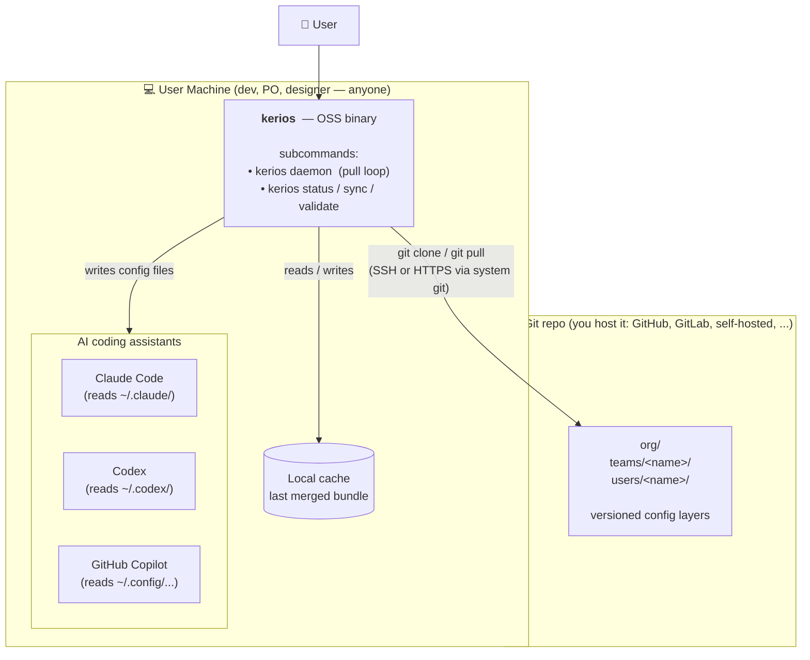
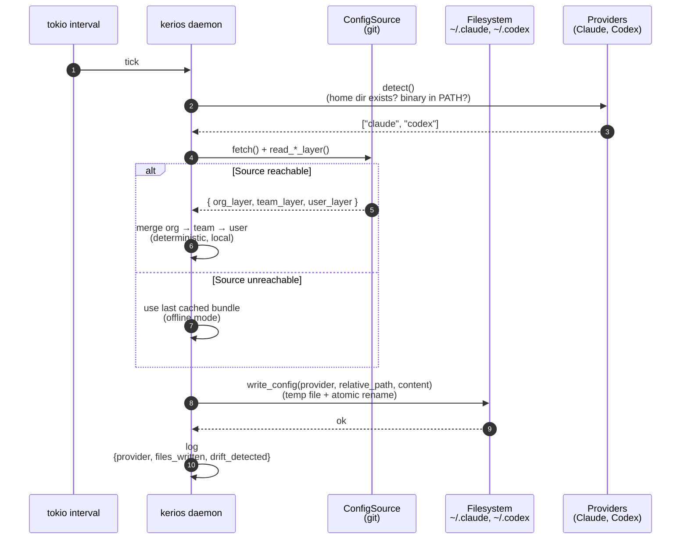
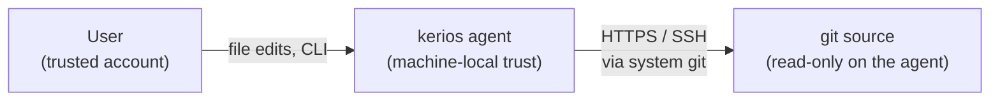

# Kerios — Architecture Overview

> A visual contract of what Kerios is and is not. If the diagrams below do not match your mental model, stop and tell us — we are about to spend weeks building the thing they describe.

---

## Vision in one paragraph

Kerios is **a Puppet-equivalent for AI coding assistants**. A small Rust daemon runs on each developer machine, pulls a versioned config bundle from any HTTPS endpoint you control, and writes that config into the places where Claude Code, Codex, and Copilot expect to find it (`~/.claude/`, `~/.codex/`, …). Kerios never reads file contents from your project and never sends data anywhere except the URL you configure.

---

## The problem in two sentences

Today every developer configures their own `~/.claude/agents/`, `~/.claude/commands/`, `~/.codex/config.toml` by hand or via shared Git repos that drift. Kerios pulls a single source of truth onto every machine so the configuration is identical, versioned, and trivially rolled back.

---

## System map



**OSS** ships one source: a git repo. The agent shells out to the system `git` binary for clone/pull, then reads `org/`, `teams/<name>/`, and `users/<name>/` directories into config layers. Auth is whatever the git remote accepts (SSH key, PAT). No server to deploy, no inbound ports.

---

## What gets synced

The daemon does not invent settings. It writes files. The set of paths it manages today:

| Provider     | Path                              | What goes there                            |
|--------------|-----------------------------------|--------------------------------------------|
| Claude Code  | `~/.claude/agents/*.md`           | Agent role definitions                     |
| Claude Code  | `~/.claude/commands/*.md`         | Slash commands                             |
| Claude Code  | `~/.claude/rules/*.md`            | Coding rules, security policies            |
| Claude Code  | `~/.claude/skills/`               | Reusable skills                            |
| Claude Code  | `~/.claude/settings.json`         | Hooks, permissions, env vars               |
| Codex        | `~/.codex/config.toml`            | Model, defaults                            |
| Copilot      | `~/.config/github-copilot/...`    | (next milestone)                           |

Anything not in this list is **not touched**. The daemon will never delete files outside its managed paths, and `kerios validate` shows the diff before any write.

The target is not just developer machines — a PO, a designer, or any team member using Claude Desktop / Cursor / Copilot is in scope. The agent therefore assumes **zero developer tooling at runtime** (no git binary, no cargo, no shell). Anything it needs is bundled in the `kerios` binary.

---

## Config sources

Kerios reads its config bundles through a `ConfigSource` trait: `fetch()`, `read_org_layer()`, `read_team_layer(name)`, `read_user_layer(name)`. New transports (S3, OCI, Vault, ...) plug in without touching the daemon loop.

The OSS build ships **one** source:

| Source | Transport                       | Auth                                   | Best for                                    |
|--------|----------------------------------|----------------------------------------|---------------------------------------------|
| `git`  | system `git` binary, any remote  | whatever `git` supports (SSH key, PAT) | teams that already manage config in git     |

Selected via `[source]` in `~/.kerios/config.toml`:

```toml
[source]
type = "git"

[source.git]
repo_url   = "git@github.com:acme/kerios-config.git"
cache_dir  = "~/.kerios/cache"
```

Sync mode in OSS is **pull**: the agent ticks at a configurable interval and runs the source's `fetch()`. No inbound port, no long-lived connection — clean for any firewall.

```toml
[sync]
mode             = "pull"
interval_secs    = 60
```

---

## One sync tick — what actually happens



Four guarantees of this loop:

1. **Local merge** — the source never sees a merged config. It serves raw layers; the daemon merges. This means offline mode works (last cached bundle), and the source stays a dumb config store.
2. **Deterministic** — same layers in, same merged config out. Versioned merge protocol so two daemons on the same layers produce byte-identical output.
3. **Drift-aware** — if a dev hand-edited `~/.claude/agents/foo.md`, the daemon detects it (hash mismatch with what it last wrote) and surfaces it before overwriting. Policy controls whether to warn or enforce.
4. **No content leaves the machine** — Kerios never reads source-code contents and never posts telemetry. It only fetches config from the URL you configure.

---

## Trust boundaries



- **User ↔ Agent**: same trust as the local user account. Files in `~/.claude/` are no more sensitive than `~/.ssh/config` — the agent does not request elevated privileges.
- **Agent ↔ git source**: HTTPS or SSH via system `git`. Auth is whatever the git remote accepts (PAT, deploy key). Revocation = revoke the credential at the git host.

---

## What Kerios is NOT

Listing this explicitly because the alternative is wasted weeks.

- **Not a chat / inference layer.** Kerios does not forward prompts, does not aggregate completions, does not run models. It only manages the *configuration* of the tools that do.
- **Not a replacement for code review or SAST.** Kerios manages provider configs. It does not look at your project code.
- **Not an "AI agent platform".** Previous attempt (artybot) tried that. This is config plumbing, not orchestration.

---

## Crate ↔ binary ↔ deployment map

| Crate              | Binary produced            | Where it runs              | Purpose                                                |
|--------------------|----------------------------|----------------------------|--------------------------------------------------------|
| `kerios-core`      | *(library only)*           | linked into `kerios`       | Config merge, provider adapters, policy engine         |
| `kerios`           | **`kerios`** *(the one)*   | each developer machine     | All functionality via subcommands                      |

**One binary on the dev machine.** Subcommands:

```
kerios daemon           # long-running sync loop
kerios status           # show daemon health + last sync
kerios sync             # force a sync now, bypass the interval
kerios validate <file>  # check a config file before applying
```

Modeled after `tailscale` / `rustup` / `kubectl` — single executable, one path in `/usr/local/bin/`, atomic upgrades.

---

## Where to look next

- Detailed ADRs and data model: [`.claude/output/architecture.md`](../.claude/output/architecture.md)
- Implementation tasks: [`.claude/output/backlog.md`](../.claude/output/backlog.md)
- Problem statement, competitive landscape: [`.claude/output/problem.md`](../.claude/output/problem.md)
